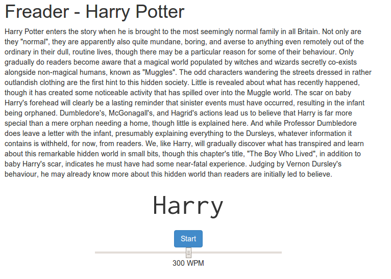

Freader - Fast Reader based on Spritz
=======

Another implementation of the ideas of Spritz.

Can be used to read between 200-600 wpm by displaying
the text word-by-word, highliting the optimal
reading position. 

Sreenshots
----------

